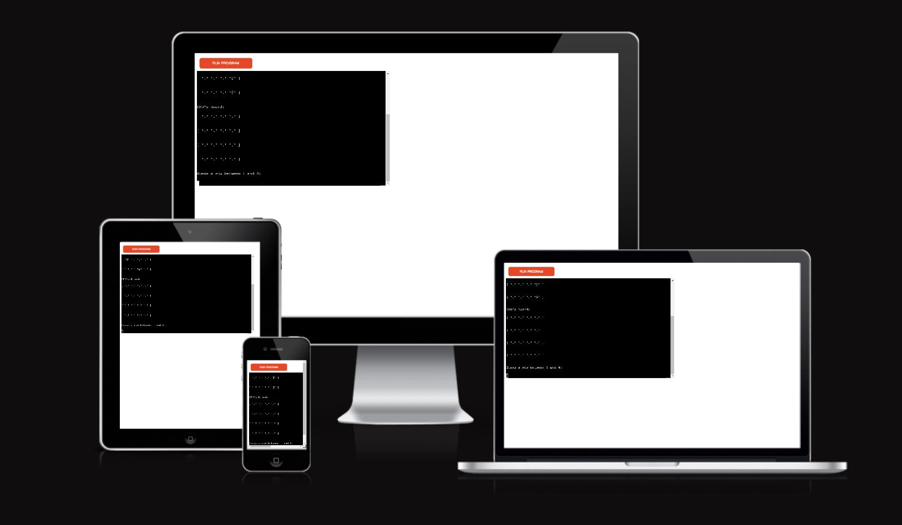
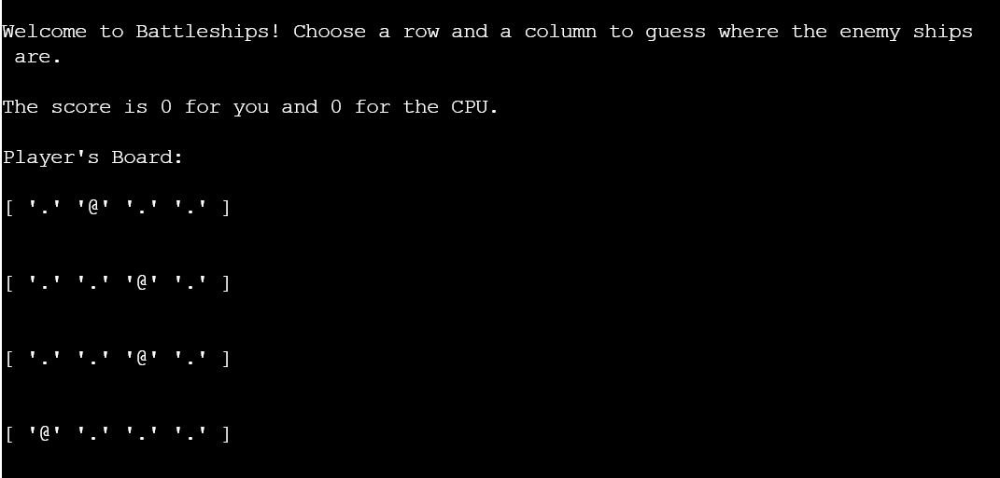
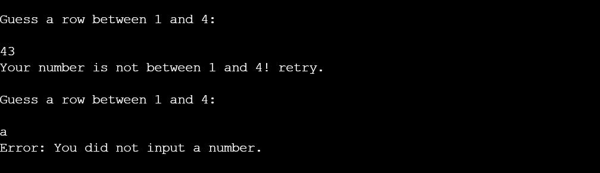
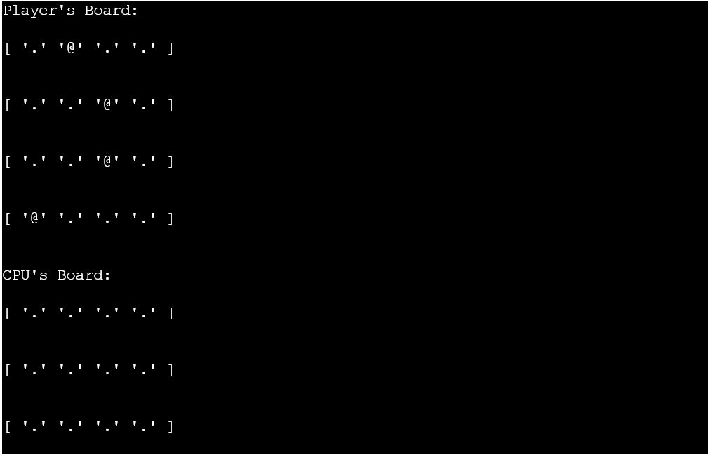

# Battleships

Battleships is a command line - based game that lets you play the classic Battleship pen and paper game against the CPU. 

## How to Play

In this version of the game, the player and the CPU square off against each other on a 4x4 grid, with 1x1 ships marked by an "@" symbol. Players can't see the CPU's ships. Misses are marked by an "X", and hits as "*". The player must keep guessing a row and a column each turn to find the CPU's ships before the computer does the same. The game ends when the Player or the CPU hit a score of 4. 

## Features 

- __Score Keeping__

  The Game keeps track of the score between the CPU and the Player and displays it at the start of each turn. 

- __Input Validation__

  The game forces the player to choose numbers between 1 and 4 for their guess. Numbers higher or lower are not allowed, and the game correctly checks that the user chose a number, not a character or symbol.  

- __Random Board Generation__

  The game generates two random boards each time it is launched. The player cannot see the CPU ships. 

 

## Testing 

- The game has been tested in the gitpod command line and inside the Heroku mock terminal. I've tested the input validation function to ensure it works correctly and played through some rounds of the game to ensure that it plays out as it should. 

## Bugs

The game has no bugs left. the following ones were found and solved during development: 

- The game holds the board, score and ship list inside a PlayerBoard Object. Due to how python handles data, I was forced to move several functions out of the Object to avoid the board, score and ship list to be shared between all PlayerBoard Objects and thus duplicated or doubled at the moment of board generation. This is due to the fact that Python wants data held in the object to be generated by the constructor at the moment of the object's creation. I therefore moved the functions meant to handle ship and board generation outside the object so that they could pass that data to the constructor from there. 

- When creating the board, it was found that the method used copied the same list of dots four times and did not create four separate lists. it was solved through the use of the ".copy()" method. 

## Validator Testing 

- PEP8
  - No significant issues were returned when the code was passed through the PEP8Online linter. The only remaining issue is about three lines of code being longer than 80 characters: these are long evaluation statements that cannot be shortened through different syntax. 

## Deployment

The project has been deployed on Heroku through the following procedure, which can be replicated after forking the repository: 
  - Create a new project on Heroku.
  - In the Settings tab, add buildpacks for Python and Node.js.
  - Add a config var called PORT with value 8000.
  - Go to the deployment page and link the app with the repository.
  - Click on "Deploy Branch."  

The game is available at the following link - https://alex-battleships.herokuapp.com/
